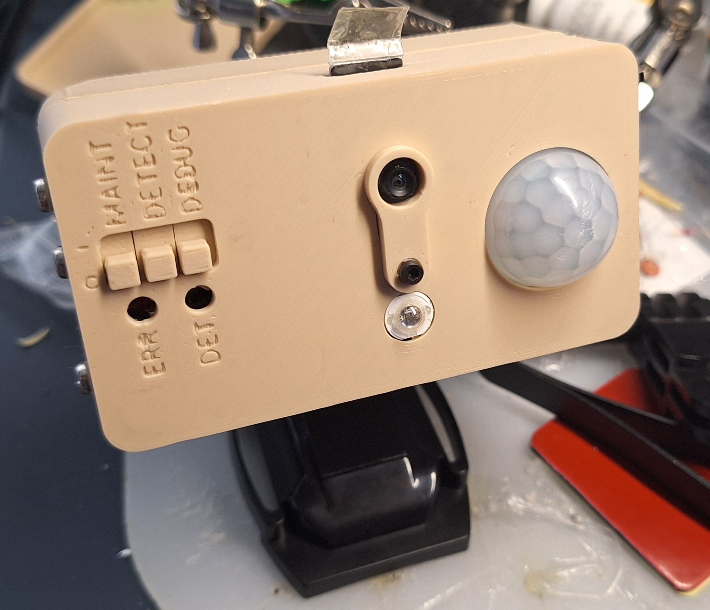
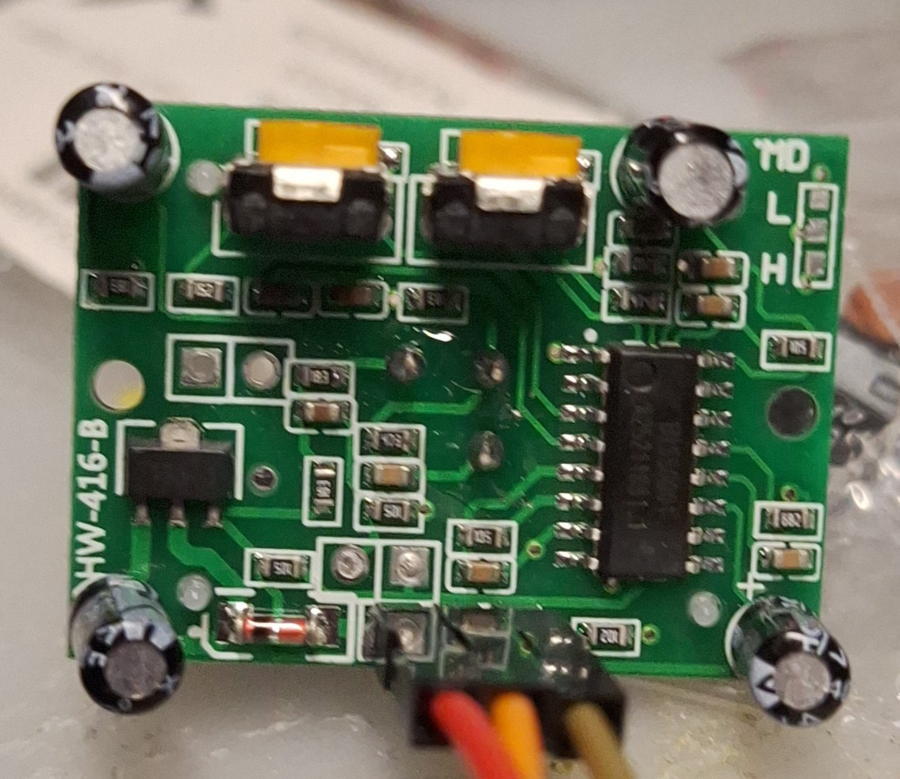
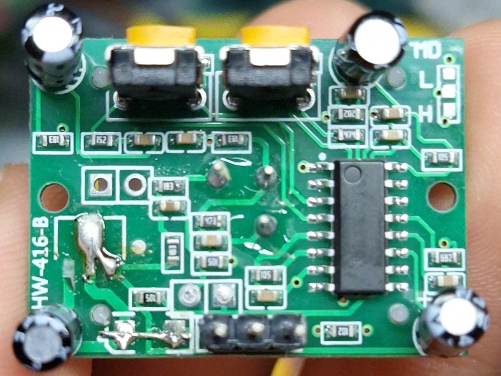
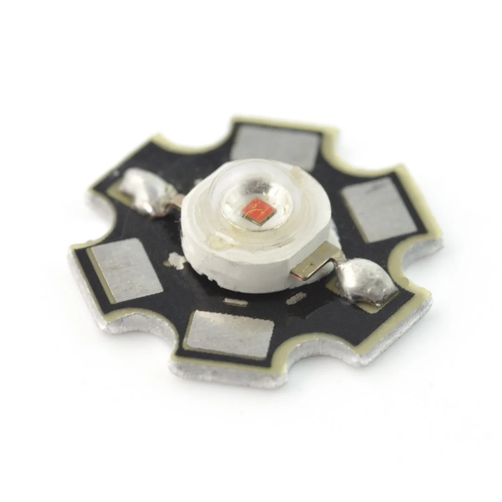
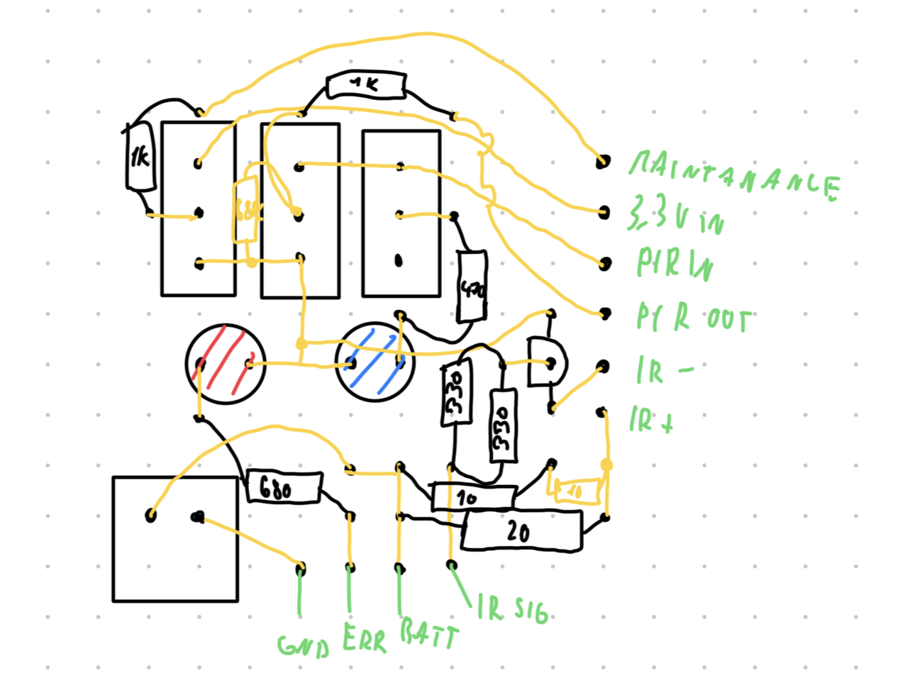
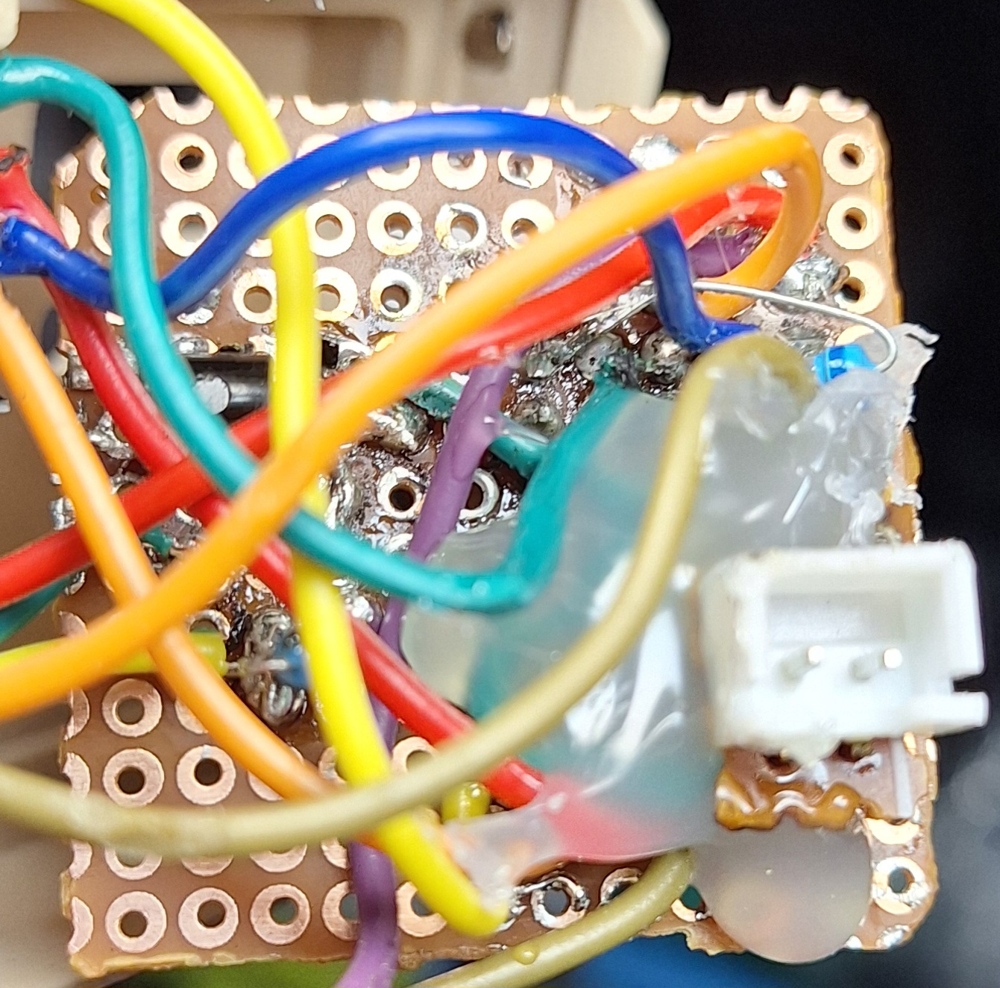
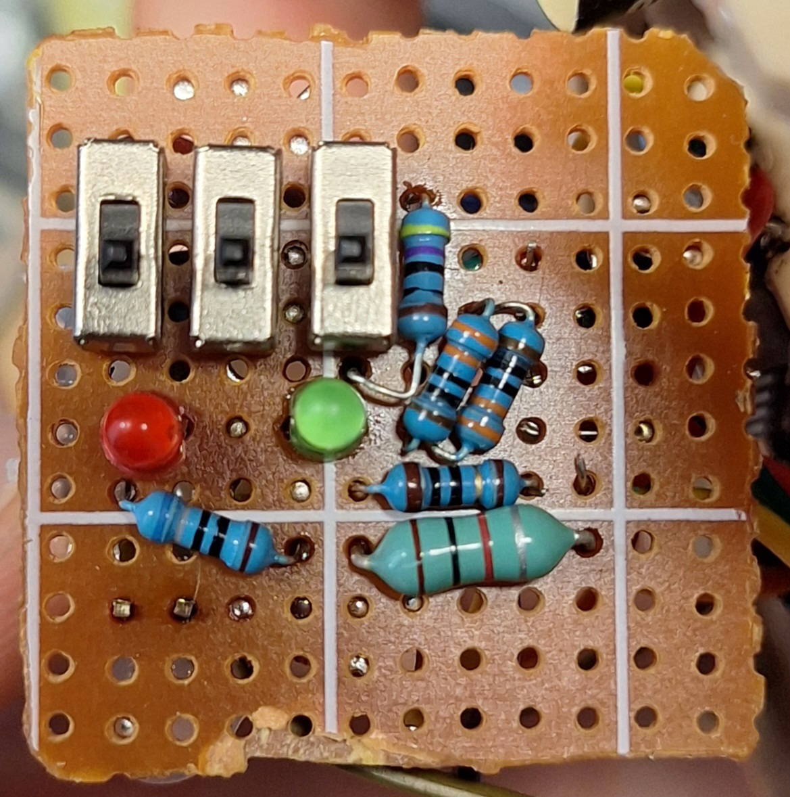

# ESP32S3 XIAO Phototrap

ESP32S3 XIAO-based low-power phototrap project.

<p align="center">
  
</p>

This guide shows how to build the phototrap step by step.

First, print all required parts. The files are located in the `cad` directory or on [Onshape](https://cad.onshape.com/documents/ead58119c3828b68d815a62f/w/7087faa25839fe28733057f0/e/a371d4849fa89fe6a0035750).

> https://cad.onshape.com/documents/ead58119c3828b68d815a62f/w/7087faa25839fe28733057f0/e/a371d4849fa89fe6a0035750
> 
> if it doesnt work, just copy the url and put it in browser manually

For printing, I used PLA because it is easy to print with, but for outdoor usage I would recommend ASA.

---

# Features

The phototrap has 3 switches:

- **Maintenance**
- **Detect**
- **Debug**

## Maintenance Mode

The **Maintenance** switch enables maintenance mode.

In this mode, the ESP32 starts a Wi-Fi access point that you can connect to.  
Then open `192.168.4.1` in your browser to access the web interface.

There you can:

- Change SSID and password
- Modify camera settings
- View a live stream
- Turn the IR LED on/off
- Monitor battery level
- View error messages
- And more

The interface supports both:

- Czech
- English

---

## Detect Switch

The **Detect** switch enables automatic recording.

When the PIR sensor detects movement, the ESP32 automatically starts recording video.

---

## Debug Switch

The **Debug** switch enables a small indicator LED below the switch.

The LED lights up whenever movement is detected.

---

## Error LED

The **Error LED** lights up whenever a critical error occurs.

Typical causes:

- Missing SD card
- Broken SD card
- Camera initialization failure

When this happens, the ESP32 also creates a Wi-Fi network and shows the exact error message on the web interface.

---

# Operation

When movement is detected while the **Detect** switch is enabled, recording starts automatically.

Recording continues as long as movement is still being detected.

---

## Power Consumption

When idle, the phototrap consumes approximately **0.3mA**.

With a **10Wh battery**, it can theoretically last for over a year.

The ESP32 wakes up only when:

- Movement is detected
- The maintenance pin is activated

---

## Downloading Videos

Recorded videos can be downloaded:

- Directly from the SD card
- Through the web interface

> **Note:**  
> Videos are encoded in a format that is not natively supported on many mobile phones.  
> Use the VLC player app for playback.

---

## PIR Sensitivity

The PIR sensor has 2 potentiometers accessible from the side of the phototrap:

- **Sensitivity adjustment**
- **Detection hold time**

---

# Miscellaneous

There are 4 possible back cover variants:

- Battery / no battery
- GoPro mount / no GoPro mount

---

# Build Process

# Required Parts

## Screws and Nuts

- 4x M3 × 6mm
- 3x M2 × 4mm
- 2x self-tapping screws, 2mm × 6mm (for mounting the PIR sensor)
- 1x M2 nut

---

## Electronics

- ESP32S3 XIAO Sense with camera expansion board
- OV3660 camera with ~21mm cable
  - OV2640 is not recommended because it cannot reliably enter standby mode and consumes around 20mA instead of ~0.3mA
  - OV5640 has not been tested
- 2.4GHz antenna
- IR LED on a 20mm star cooling pad (850nm recommended)
- Li-Pol battery — specifically `954060 3000mAh 1S / 3.7V`
- Battery connector for the PCB (I used JST-XH 2.54mm)
- 3x DPS switches — `SS12D00G4`
- 3mm red LED
- 3mm blue or green LED
- PIR sensor `HC-SR501`
- NPN transistor (2N2222 recommended)

---

## Resistors

- 2x 330Ω
- 1x 470Ω
- 1x 680Ω
- 2x 1kΩ

For the IR LED, use higher-power resistors (around 1W) and create a resistance between **8Ω and 10Ω**.

Example combination:

- 2.2Ω + 6.8Ω

---

## Additional Materials

- Small prototyping PCB (DPS board)

The exact size does not matter because it must be trimmed to fit.

---

# PIR Sensor Modification

The HC-SR501 normally operates from **4.5–20V**, which is not ideal for this project.

To make it work directly from **3.3V**:

1. Remove the voltage regulator
2. Remove the diode
3. Replace them with solder bridges or short wires

Like this:

<p align="center">
  
  
</p>

After this modification, the PIR sensor can run directly from 3.3V.

---

# IR LED

<p align="center">
  
</p>

Solder wires to the IR LED:

- `+`
- `-`

Before snapping the LED into place, insert the **M2 nut** into its slot.

Then snap the IR LED into position.

---

# ESP32 Assembly

First, separate the ESP32S3 XIAO Sense into its parts:

- Main board
- Expansion board
- Camera
- Antenna

## Assembly Steps

1. Connect the antenna to the main board
2. Slide the camera into its slot
3. Connect the camera to the expansion board
4. Insert the main board into the top slot
5. While inserting it, connect it to the expansion board
6. Route the antenna cable through the cable slot
7. Secure everything using screws or glue

---

# Main PCB

This is the most difficult part because the board must be assembled manually.

The exact component placement is not critical except for:

- Switches
- LEDs
- Battery connector

For placement details, check the Onshape CAD model linked above.

Recommended PCB size:

- Approximately `3.2 × 3.3 cm`

Trim it as necessary.

---

## Circuit Diagram

<a href="images/Phototrap circuit.pdf">
  
</a>

---

## PCB Assembly Example

<p align="center">
  
  
  
</p>

---

# Final Assembly

Once everything is assembled:

1. Connect all wires according to the circuit diagram
2. Upload the firmware
3. Test the device

---

# Uploading the Firmware

1. Open the `.ino` file in Arduino IDE
2. Place the `.ino` file into a folder with the same name as the file
3. Install the ESP32 board package
4. Enable **PSRAM**
5. Select the correct board
6. Select the correct flash size (8MB)

---

## Pin Configuration

Check that the GPIO assignments match your hardware.

> These are GPIO numbers, not `D#` labels.

```cpp
static const int PIR_PIN    = 4;
static const int MAINT_PIN  = 3;
static const int IR_LED_PIN = 2;
static const int ERROR_PIN  = 5;

// Battery measurement on GPIO1 through 1/2 voltage divider
static const int BAT_ADC_PIN = 1;
````

```
```
